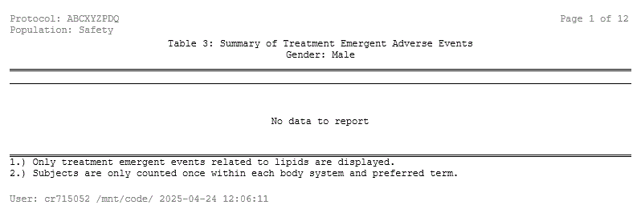
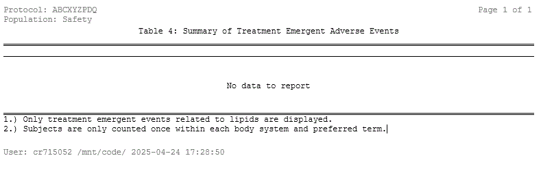
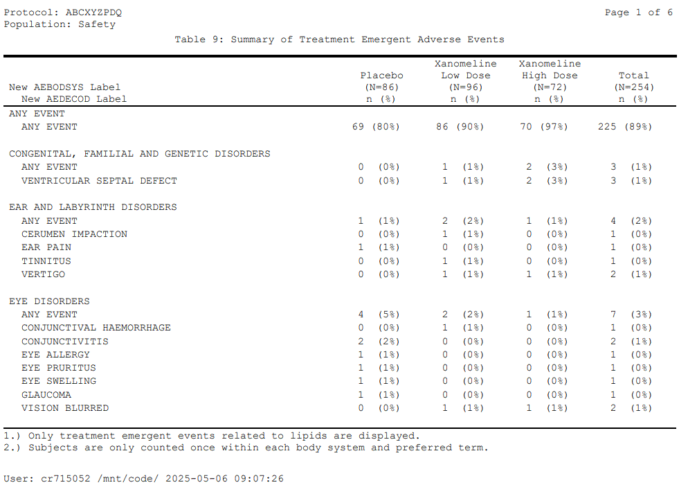
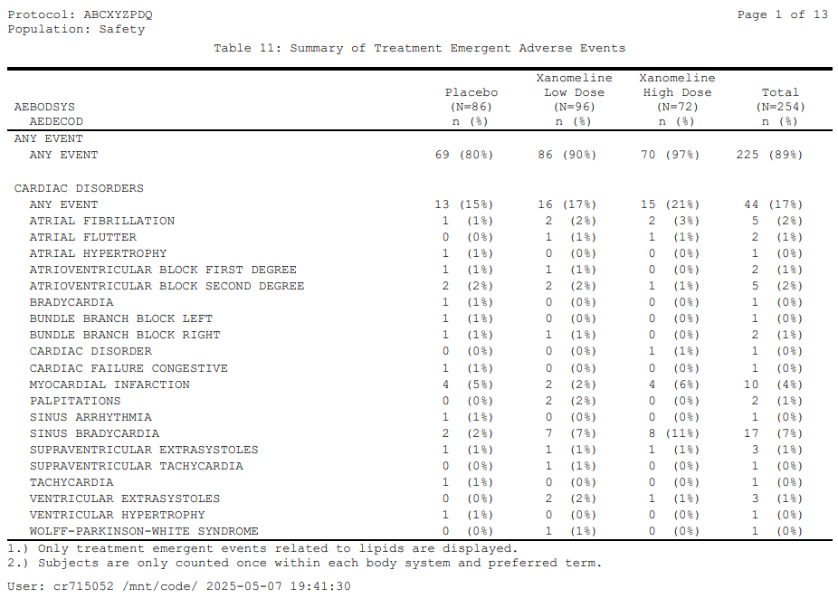
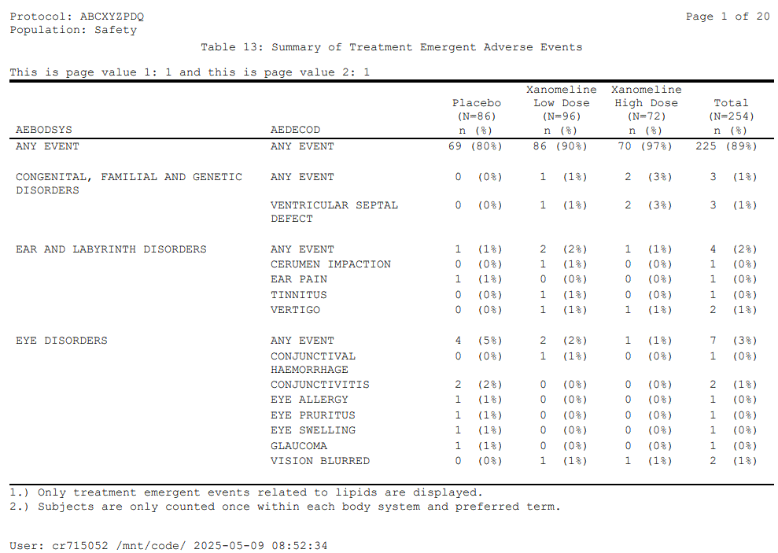

# AE-Tbls

## Vignette Build Datetime

``` r
message(paste0('Datetime: ',Sys.Date(),':',Sys.time()))
#> Datetime: 2026-01-06:2026-01-06 21:01:29.370141
```

## Load Libraries

``` r
library(repfun)
library(dplyr)
library(DT)
library(kableExtra)
```

## Set Up the Reporting Environment

``` r
tmpdr <- tempdir()
datdir <- file.path(gsub("\\","/",tmpdr,fixed=TRUE),"datdir")
dir.create(datdir,showWarnings=FALSE)
repfun::copydata(datdir)
setup <- function(tlfid){
 repfun::rs_setup(
   D_DATADATE=Sys.Date(),
   D_DSPLYNUM=tlfid,
   D_FOOT1='1.) Only treatment emergent events related to lipids are displayed.',
   D_FOOT2='2.) Subjects are only counted once within each body system and preferred term.',
   D_KEEPPOPVARS=c('STUDYID','USUBJID','SAFFL'),
   D_OUTFILE=paste0(tmpdr,"/t_ru_list_",tlfid,".rtf"),
   D_PGMPTH="~/vignettes/AE-Tbls.Rmd",
   D_STUDYID='ABCXYZPDQ',
   D_POP="SAFFL",
   D_POPDATA=repfun::adsl %>% dplyr::filter(SAFFL =='Y') %>% 
             dplyr::mutate(TRT01AN=ifelse(TRT01A=='Placebo',1,ifelse(TRT01A=='Xanomeline Low Dose',2,3))) %>%
             repfun::ru_labels(varlabels=list('TRT01AN'='Actual Treatment for Period 01 (n)')),
   D_POPLBL="Safety",
   D_SUBJID=c("STUDYID","USUBJID"),
   D_TITLE1=paste0('Table ',tlfid,': Summary of Treatment Emergent Adverse Events'),
   R_DDDATA=paste0(tmpdr,'/t_ru_list_',tlfid,'.rds'),
   R_ADAMDATA=datdir)
}
```

## Read in ADAE and Generate Frequency Counts and Percents

``` r
setup(1)
tbl1dd <- paste0(tmpdr,"/t_ru_list_1.rds")
aesum <- repfun::ru_freq(repfun:::rfenv$adamdata$adae.rda() %>% dplyr::select(-SAFFL) %>% 
                   repfun::ru_getdata(repfun:::rfenv$G_POPDATA, c("STUDYID", "USUBJID"), keeppopvars=c("TRT01AN", "TRT01A")),
                 dsetindenom=repfun:::rfenv$G_POPDATA,
                 countdistinctvars=c('STUDYID','USUBJID'),
                 groupbyvarsnumer=c('TRT01AN','TRT01A','AEBODSYS','AEDECOD'),
                 anyeventvars = c('AEBODSYS','AEDECOD'),
                 anyeventvalues = c('ANY EVENT','ANY EVENT'),
                 groupbyvarsdenom=c('TRT01AN'),
                 resultstyle="NUMERPCT",
                 totalforvar=c('TRT01AN'),
                 totalid=99,
                 totaldecode='Total',
                 codedecodevarpairs=c("TRT01AN", "TRT01A"),
                 resultpctdps=0) %>% 
  dplyr::arrange(TRT01AN,TRT01A,AEBODSYS,tt_summarylevel,AEDECOD,NUMERCNT,DENOMCNT) %>% 
  repfun::ru_align("tt_result")
```

------------------------------------------------------------------------

## Generate Table 1: Summary of Adverse Events \[Keywords: NoWidows (Does not fit), Simple Paging Default, OrderVars, Denorm\]

------------------------------------------------------------------------

``` r
repfun::ru_list(aesum,
        columns=c('AEBODSYS','AEDECOD','tt_01','tt_02','tt_03','tt_99'),
        nowidowvar='AEBODSYS',
        widths=c(5.5,4.5,1.75,1.9,1.9,1.75),
        skipvars=c('AEBODSYS'),
        centrevars=c('tt_01','tt_02','tt_03','tt_99'),
        ordervars=c('AEBODSYS','tt_summarylevel','AEDECOD'),
        noprintvars=c('tt_summarylevel'),
        denormyn='Y',
        varsToDenorm=c('tt_result'),
        groupByVars=c('AEBODSYS','tt_summarylevel','AEDECOD'),
        acrossVar="TRT01AN",
        acrossVarLabel="TRT01A",
        acrossColVarPrefix='tt_',
        dddatasetlabel=paste0('DD Dataframe for AE Table ',repfun:::rfenv$G_DSPLYNUM),
        lpp=23)
```

### Select Page(s) of Table 1 (1)


Table 1 (pg 1) Image

### DDDATA for Table 1 (First few obs)

``` r
t1 <- readRDS(repfun:::rfenv$G_DDDATA) %>% dplyr::filter(AEDECOD != '') %>% dplyr::filter(row_number()<=10)
lbls <- sapply(t1,function(x){attr(x,"label")})
names(t1) <- paste(names(lbls),lbls,sep=": ")
DT::datatable(
  t1, extensions = 'FixedColumns',
  options = list(
  dom = 't',
  pageLength=1000,
  scrollY = 300,
  scrollX = TRUE,
  scrollCollapse = TRUE
))
```

### Table 1 RTF

[Download](https://github.com/GSK-Biostatistics/repfun/blob/misc/outputs/t_ru_list_1.rtf)

### Table 1 PDF

[View](https://github.com/GSK-Biostatistics/repfun/blob/misc/outputs/t_ru_list_1.pdf)

------------------------------------------------------------------------

## Generate Table 2: Summary of Adverse Events \[Keywords: NoWidows, SkipVars, OrderVars, Denorm\]

------------------------------------------------------------------------

``` r
setup(2)
SOCterms <- aesum %>% distinct(AEBODSYS,AEDECOD)
SOCcnts <- table(SOCterms$AEBODSYS)
repfun::ru_list(aesum %>% dplyr::filter(!(AEBODSYS %in% names(SOCcnts[SOCcnts>=20]))),
        columns=c('AEBODSYS','AEDECOD','tt_01','tt_02','tt_03','tt_99'),
        nowidowvar='AEBODSYS',
        widths=c(5.5,4.5,1.75,1.9,1.9,1.75),
        skipvars=c('AEBODSYS'),
        centrevars=c('tt_01','tt_02','tt_03','tt_99'),
        ordervars=c('AEBODSYS','tt_summarylevel','AEDECOD'),
        noprintvars=c('tt_summarylevel'),
        denormyn='Y',
        varsToDenorm=c('tt_result'),
        groupByVars=c('AEBODSYS','tt_summarylevel','AEDECOD'),
        acrossVar="TRT01AN",
        acrossVarLabel="TRT01A",
        acrossColVarPrefix='tt_',
        dddatasetlabel=paste0('DD Dataframe for AE Table ',repfun:::rfenv$G_DSPLYNUM),
        lpp=24)
```

### Select Page(s) of Table 2 (1)


Table 2 (pg 1) Image

### DDDATA for Table 2 (First few obs)

``` r
t2 <- readRDS(repfun:::rfenv$G_DDDATA) %>% dplyr::filter(AEDECOD != '') %>% dplyr::filter(row_number()<=10)
lbls <- sapply(t2,function(x){attr(x,"label")})
names(t2) <- paste(names(lbls),lbls,sep=": ")
datatable(
  t2, extensions = 'FixedColumns',
  options = list(
  dom = 't',
  pageLength=1000,
  scrollY = 300,
  scrollX = TRUE,
  scrollCollapse = TRUE
))
```

### Table 2 RTF

[Download](https://github.com/GSK-Biostatistics/repfun/blob/misc/outputs/t_ru_list_2.rtf)

### Table 2 PDF

[View](https://github.com/GSK-Biostatistics/repfun/blob/misc/outputs/t_ru_list_2.pdf)

------------------------------------------------------------------------

## Generate Table 3: Summary of Adverse Events by Gender \[Keywords: Pageby, NoWidows, Skipvars, ShareColVars, NoData\]

------------------------------------------------------------------------

``` r
setup(3)
df <- readRDS(file=tbl1dd) %>% 
  dplyr::select(-PAGEVAR) %>% dplyr::filter(!(AEDECOD == '')) %>% 
  dplyr::filter(!(AEBODSYS %in% names(SOCcnts[SOCcnts>=15])))
dfpg <- rbind(df %>% dplyr::mutate(AESER='Yes'), df %>% dplyr::mutate(AESER='No')) 
attr(dfpg[['AESER']],'label') <- 'Serious AE (Y/N)'
mytbls <- list('Gender: Male'=dfpg[0,], 'Gender: Female'=dfpg)
repfun::ru_list(dsetin=mytbls,
        columns=c('AESER','AEBODSYS','AEDECOD','tt_01','tt_02','tt_03','tt_99'),
        nowidowvar='AEBODSYS',
        sharecolvars=c('AESER','AEBODSYS','AEDECOD'),
        widths=c(7,1.65,1.9,1.9,1.65),
        skipvars=c('AEBODSYS'),
        centrevars=c('tt_01','tt_02','tt_03','tt_99'),
        lpp = 30,
        dddatasetlabel=paste0('DD Dataframe for AE Table ',repfun:::rfenv$G_DSPLYNUM))
```

### Select Page(s) of Table 3 (1)



Table 3 (pg 1) Image

### DDDATA for Table 3 (First few obs)

``` r
t3 <- readRDS(repfun:::rfenv$G_DDDATA) %>% dplyr::filter(gsub("\\s+", "",STACKVAR) != '') %>% dplyr::filter(row_number()<=10)
lbls <- sapply(t3,function(x){attr(x,"label")})
names(t3) <- paste(names(lbls),lbls,sep=": ")
datatable(
  t3, extensions = 'FixedColumns',
  options = list(
  dom = 't',
  pageLength=1000,
  scrollY = 300,
  scrollX = TRUE,
  scrollCollapse = TRUE
))
```

### Table 3 RTF

[Download](https://github.com/GSK-Biostatistics/repfun/blob/misc/outputs/t_ru_list_3.rtf)

### Table 3 PDF

[View](https://github.com/GSK-Biostatistics/repfun/blob/misc/outputs/t_ru_list_3.pdf)

------------------------------------------------------------------------

## Generate Table 4: Summary of Adverse Events when Data Frame is Empty \[Keywords: NoData\]

------------------------------------------------------------------------

``` r
setup(4)
df <- readRDS(file=tbl1dd) %>% dplyr::select(-PAGEVAR) %>% dplyr::filter(!(AEDECOD == '')) 
repfun::ru_list(dsetin=df[0,], 
        columns=c('AEBODSYS','AEDECOD','tt_01','tt_02','tt_03','tt_99'), 
        ordervars=c('AEBODSYS','AEDECOD'), 
        orderdata=TRUE, 
        widths=c(7,5,2,2,2,2), 
        dddatasetlabel=paste0('DD Dataframe for AE Table ',repfun:::rfenv$G_DSPLYNUM)) 
```

### Select Page(s) of Table 4 (1)



Table 4 (pg 1) Image

### Note: There is no DDDATA for Table 4

### Table 4 RTF

[Download](https://github.com/GSK-Biostatistics/repfun/blob/misc/outputs/t_ru_list_4.rtf)

### Table 4 PDF

[View](https://github.com/GSK-Biostatistics/repfun/blob/misc/outputs/t_ru_list_4.pdf)

------------------------------------------------------------------------

## Generate Table 5: Summary of Adverse Events \[Keywords: Stackvars, NoWidows, SkipVars, PageByVar, PageVar\]

------------------------------------------------------------------------

``` r
setup(5)

df <- readRDS(file=tbl1dd) %>% 
  dplyr::select(-PAGEVAR,-tt_99) %>% dplyr::filter(!(AEDECOD == '')) %>%
  dplyr::filter(!(AEBODSYS %in% names(SOCcnts[SOCcnts>=15]))) %>%
  dplyr::group_by(AEBODSYS) %>% 
  dplyr::mutate(AESOC=ifelse(row_number()==1,paste0(AEBODSYS,': '),gsub('.',' ',paste0(AEBODSYS,': ')))) %>%
  dplyr::mutate(AESOC=ifelse(nchar(AEBODSYS)>55,gsub('^[ ][ ]*','  ',AESOC),AESOC)) %>% 
  dplyr::select(AEBODSYS,AESOC,everything())
dfpg <- rbind(df %>% dplyr::mutate(MYPAGEVAR=1),
              df %>% dplyr::mutate(MYPAGEVAR=2)) %>% 
        repfun::ru_labels(varlabels=list('AESOC'='Body System: ','MYPAGEVAR'='My Page Variable'))

mytbls <- list('Gender: Male'=dfpg,
               'Gender: Female'=dfpg %>%
                                repfun::ru_labels(varlabels=lapply(sapply(dfpg,function(x){attr(x,"label")}),function(x) gsub('X','Y',x))))

repfun::ru_list(dsetin=mytbls,
               stackvar1=list(varsin=c('AESOC','AEDECOD'), varout='SYSPREF', sepc='', splitc=''),
               noprintvars=c('AEBODSYS'),
               columns=c('AEBODSYS','SYSPREF','tt_01','tt_02','tt_03'),
               nowidowvar='AEBODSYS',
               widths=c(13,2,2.3,2.3),
               skipvars=c('AEBODSYS'),
               centrevars=c('tt_01','tt_02','tt_03'),
               pagevars=c('MYPAGEVAR'),
               computebeforepagelines="paste0('This is page value: ',MYPAGEVAR)",
               lpp = 25,
               dddatasetlabel=paste0('DD Dataframe for AE Table ',repfun:::rfenv$G_DSPLYNUM))
```

### Select Page(s) of Table 5 (1)


Table 5 (pg 1) Image

### DDDATA for Table 5 (First few obs)

``` r
t5 <- readRDS(repfun:::rfenv$G_DDDATA) %>% dplyr::filter(SYSPREF != '') %>% dplyr::filter(row_number()<=10)
lbls <- sapply(t5,function(x){attr(x,"label")})
names(t5) <- paste(names(lbls),lbls,sep=": ")
datatable(
  t5, extensions = 'FixedColumns',
  options = list(
  dom = 't',
  pageLength=1000,
  scrollY = 300,
  scrollX = TRUE,
  scrollCollapse = TRUE
))
```

### Table 5 RTF

[Download](https://github.com/GSK-Biostatistics/repfun/blob/misc/outputs/t_ru_list_5.rtf)

### Table 5 PDF

[View](https://github.com/GSK-Biostatistics/repfun/blob/misc/outputs/t_ru_list_5.pdf)

------------------------------------------------------------------------

## Generate Table 6: Summary of Adverse Events \[Keywords: NoWidows, SkipVars, PageByVar, PageByLabel\]

------------------------------------------------------------------------

``` r
setup(6)

df <- readRDS(file=tbl1dd) %>% dplyr::select(-PAGEVAR) %>% 
  dplyr::filter(!(AEDECOD == '') & !(AEBODSYS %in% names(SOCcnts[SOCcnts>=15]))) 
dfpg <- rbind(df %>% dplyr::mutate(MYPAGEVAR=1),df %>% dplyr::mutate(MYPAGEVAR=2)) %>% repfun::ru_labels(varlabels=list('MYPAGEVAR'='My Page Variable'))

repfun::ru_list(dsetin=dfpg,
        columns=c('AEBODSYS','AEDECOD','tt_01','tt_02','tt_03','tt_99'),
        widths=c(5.5,4.5,2,2,2,2),
        nowidowvar='AEBODSYS',
        skipvars=c('AEBODSYS'),
        centrevars=c('tt_01','tt_02','tt_03','tt_99'),
        pagevars=c('MYPAGEVAR'),
        computebeforepagelines="paste0('This is page value: ',MYPAGEVAR)",
        lpp=23,
        dddatasetlabel=paste0('DD Dataframe for AE Table ',repfun:::rfenv$G_DSPLYNUM))
```

### Select Page(s) of Table 6 (1)


Table 6 (pg 1) Image

### DDDATA for Table 6 (First few obs)

``` r
t6 <- readRDS(repfun:::rfenv$G_DDDATA) %>% dplyr::filter(AEDECOD != '') %>% dplyr::filter(row_number()<=10)
lbls <- sapply(t6,function(x){attr(x,"label")})
names(t6) <- paste(names(lbls),lbls,sep=": ")
datatable(
  t6, extensions = 'FixedColumns',
  options = list(
  dom = 't',
  pageLength=1000,
  scrollY = 300,
  scrollX = TRUE,
  scrollCollapse = TRUE
))
```

### Table 6 RTF

[Download](https://github.com/GSK-Biostatistics/repfun/blob/misc/outputs/t_ru_list_6.rtf)

### Table 6 PDF

[View](https://github.com/GSK-Biostatistics/repfun/blob/misc/outputs/t_ru_list_6.pdf)

------------------------------------------------------------------------

## Generate Table 7: Summary of Adverse Events \[Keywords: NoWidows, SkipVars, ByVars, PageVars, ComputeBeforePageLines (2 page-by variables)\]

------------------------------------------------------------------------

``` r
setup(7)

df <- readRDS(file=tbl1dd) %>% dplyr::select(-PAGEVAR) %>%
  dplyr::filter(!(AEDECOD == '') & !(AEBODSYS %in% names(SOCcnts[SOCcnts>=15])))

dfpg <- rbind(df %>% dplyr::mutate(MYPAGEVAR1=1,MYPAGEVAR2=1),
              df %>% dplyr::mutate(MYPAGEVAR1=1,MYPAGEVAR2=2),
              df %>% dplyr::mutate(MYPAGEVAR1=2,MYPAGEVAR2=3),
              df %>% dplyr::mutate(MYPAGEVAR1=2,MYPAGEVAR2=4)) %>%
  repfun::ru_labels(varlabels=list('MYPAGEVAR'='My Page Variable'))

repfun::ru_list(dsetin=dfpg,
        columns=c('AEBODSYS','AEDECOD','tt_01','tt_02','tt_03','tt_99'),
        nowidowvar='AEBODSYS',
        widths=c(6,4,2,2,2,2),
        skipvars=c('AEBODSYS'),
        centrevars=c('tt_01','tt_02','tt_03','tt_99'),
        byvars=c('MYPAGEVAR2'),
        pagevars=c('MYPAGEVAR1'),
        computebeforepagelines="paste0('This is page value 1: ',MYPAGEVAR1,' and this is page value 2: ',MYPAGEVAR2)",
        lpp=23,
        dddatasetlabel=paste0('DD Dataframe for AE Table ',repfun:::rfenv$G_DSPLYNUM))
```

### Select Page(s) of Table 7 (1)


Table 7 (pg 1) Image

### DDDATA for Table 7 (First few obs)

``` r
t7 <- readRDS(repfun:::rfenv$G_DDDATA) %>% dplyr::filter(AEDECOD != '') %>% dplyr::filter(row_number()<=10)
lbls <- sapply(t7,function(x){attr(x,"label")})
names(t7) <- paste(names(lbls),lbls,sep=": ")
datatable(
  t7, extensions = 'FixedColumns',
  options = list(
  dom = 't',
  pageLength=1000,
  scrollY = 300,
  scrollX = TRUE,
  scrollCollapse = TRUE
))
```

### Table 7 RTF

[Download](https://github.com/GSK-Biostatistics/repfun/blob/misc/outputs/t_ru_list_7.rtf)

### Table 7 PDF

[View](https://github.com/GSK-Biostatistics/repfun/blob/misc/outputs/t_ru_list_7.pdf)

------------------------------------------------------------------------

## Generate Table 8: Summary of Adverse Events \[Keywords: NoWidows, SkipVars, ShareColVars, PageBy (w/Changing Column Headers)\]

------------------------------------------------------------------------

``` r
setup(8)
df <- readRDS(file=tbl1dd) %>%
  dplyr::select(-PAGEVAR) %>%
  dplyr::filter(!(AEDECOD == '') & !(AEBODSYS %in% names(SOCcnts[SOCcnts>=15])))

mytbls <- list('Gender: Male'=df,
               'Gender: Female'=df %>% 
                 repfun::ru_labels(varlabels=lapply(sapply(df,function(x){attr(x,"label")}),function(x) gsub('X','Y',x))))

repfun::ru_list(dsetin=mytbls,
        columns=c('AEBODSYS','AEDECOD','tt_01','tt_02','tt_03','tt_99'),
        nowidowvar='AEBODSYS',
        sharecolvars=c('AEBODSYS','AEDECOD'),
        widths=c(8.0,2,2,2,2),
        skipvars=c('AEBODSYS'),
        centrevars=c('tt_01','tt_02','tt_03','tt_99'),
        lpp=28,
        dddatasetlabel=paste0('DD Dataframe for AE Table ',repfun:::rfenv$G_DSPLYNUM))
```

### Select Page(s) of Table 8 (1)


Table 8 (pg 1) Image

### DDDATA for Table 8 (First few obs)

``` r
t8 <- readRDS(repfun:::rfenv$G_DDDATA) %>% dplyr::filter(gsub("\\s+", "", STACKVAR) != '') %>% dplyr::filter(row_number()<=10)
lbls <- sapply(t8,function(x){attr(x,"label")})
names(t8) <- paste(names(lbls),lbls,sep=": ")
datatable(
  t8, extensions = 'FixedColumns',
  options = list(
  dom = 't',
  pageLength=1000,
  scrollY = 300,
  scrollX = TRUE,
  scrollCollapse = TRUE
))
```

### Table 8 RTF

[Download](https://github.com/GSK-Biostatistics/repfun/blob/misc/outputs/t_ru_list_8.rtf)

### Table 8 PDF

[View](https://github.com/GSK-Biostatistics/repfun/blob/misc/outputs/t_ru_list_8.pdf)

------------------------------------------------------------------------

## Generate Table 9: Summary of Adverse Events \[Keywords: NoWidows, SkipVars, ShareColVars, Update Column Labels\]

------------------------------------------------------------------------

``` r
setup(9)

df <- readRDS(file=tbl1dd) %>%
  dplyr::select(-PAGEVAR) %>%
  dplyr::filter(!(AEDECOD == '') & !(AEBODSYS %in% names(SOCcnts[SOCcnts>=15])))

repfun::ru_list(dsetin=df,
        columns=c('AEBODSYS','AEDECOD','tt_01','tt_02','tt_03','tt_99'),
        nowidowvar='AEBODSYS',
        widths=c(8.0,2,2,2,2),
        skipvars=c('AEBODSYS'),
        sharecolvars=c('AEBODSYS','AEDECOD'),
        centrevars=c('tt_01','tt_02','tt_03','tt_99'),
        labels=list('AEDECOD'='New AEDECOD Label', 'AEBODSYS'='New AEBODSYS Label'),
        lpp=28,
        dddatasetlabel=paste0('DD Dataframe for AE Table ',repfun:::rfenv$G_DSPLYNUM))
```

### Select Page(s) of Table 9 (1)



Table 9 (pg 1) Image

------------------------------------------------------------------------

### DDDATA for Table 9 (First few obs)

``` r
t9 <- readRDS(repfun:::rfenv$G_DDDATA) %>% dplyr::filter(gsub("\\s+", "", STACKVAR) != '') %>% dplyr::filter(row_number()<=10)
lbls <- sapply(t9,function(x){attr(x,"label")})
names(t9) <- paste(names(lbls),lbls,sep=": ")
datatable(
  t9, extensions = 'FixedColumns',
  options = list(
  dom = 't',
  pageLength=1000,
  scrollY = 300,
  scrollX = TRUE,
  scrollCollapse = TRUE
))
```

### Table 9 RTF

[Download](https://github.com/GSK-Biostatistics/repfun/blob/misc/outputs/t_ru_list_9.rtf)

### Table 9 PDF

[View](https://github.com/GSK-Biostatistics/repfun/blob/misc/outputs/t_ru_list_9.pdf)

------------------------------------------------------------------------

## Generate Table 10: Summary of Adverse Events \[Keywords: NoWidows, SkipVars, ShareColVars, Two PageByVars, ReOrder Pages\]

------------------------------------------------------------------------

``` r
setup(10)

df <- readRDS(file=tbl1dd) %>%
  dplyr::select(-PAGEVAR) %>%
  dplyr::filter(!(AEDECOD == '') & !(AEBODSYS %in% names(SOCcnts[SOCcnts>=15])))

dfpg <- rbind(df %>% dplyr::mutate(MYPAGEVAR1='1:XYZ',MYPAGEVAR2='1:JKL'),
              df %>% dplyr::mutate(MYPAGEVAR1='1:XYZ',MYPAGEVAR2='2:GHI'),
              df %>% dplyr::mutate(MYPAGEVAR1='2:UVW',MYPAGEVAR2='3:DEF'),
              df %>% dplyr::mutate(MYPAGEVAR1='2:UVW',MYPAGEVAR2='4:ABC')) %>%
  repfun::ru_labels(varlabels=list('MYPAGEVAR1'='My Page Variable 1',
                           'MYPAGEVAR2'='My Page Variable 2'))

repfun::ru_list(dsetin=dfpg,
        columns=c('AEBODSYS','AEDECOD','tt_01','tt_02','tt_03','tt_99'),
        nowidowvar='AEBODSYS',
        sharecolvars=c('AEBODSYS','AEDECOD'),
        widths=c(8,2,2,2,2),
        skipvars=c('AEBODSYS'),
        centrevars=c('tt_01','tt_02','tt_03','tt_99'),
        pagevars=c('MYPAGEVAR1','MYPAGEVAR2'),
        lpp=27,
        computebeforepagelines="paste0('This is page value 1: ',
                                sub('[0-9]:','',MYPAGEVAR1),
                                ' and this is page value 2: ',
                                sub('[0-9]:','',MYPAGEVAR2))",
        dddatasetlabel=paste0('DD Dataframe for AE Table ',repfun:::rfenv$G_DSPLYNUM))
```

### Select Page(s) of Table 10 (1)


Table 10 (pg 1) Image

### DDDATA for Table 10 (First few obs)

``` r
t10 <- readRDS(repfun:::rfenv$G_DDDATA) %>% dplyr::filter(gsub("\\s+", "", STACKVAR) != '') %>% dplyr::filter(row_number()<=10)
lbls <- sapply(t10,function(x){attr(x,"label")})
names(t10) <- paste(names(lbls),lbls,sep=": ")
datatable(
  t10, extensions = 'FixedColumns',
  options = list(
  dom = 't',
  pageLength=1000,
  scrollY = 300,
  scrollX = TRUE,
  scrollCollapse = TRUE
))
```

### Table 10 RTF

[Download](https://github.com/GSK-Biostatistics/repfun/blob/misc/outputs/t_ru_list_10.rtf)

### Table 10 PDF

[View](https://github.com/GSK-Biostatistics/repfun/blob/misc/outputs/t_ru_list_10.pdf)

------------------------------------------------------------------------

## Generate Table 11: Summary of Adverse Events \[Keywords: SkipVars, ShareColVars\]

------------------------------------------------------------------------

``` r
setup(11)

df <- readRDS(file=tbl1dd) %>%
  dplyr::select(-PAGEVAR) %>% dplyr::filter(!(AEDECOD == '')) 
repfun::ru_list(dsetin=df,
        columns=c('AEBODSYS','AEDECOD','tt_01','tt_02','tt_03','tt_99'),
        sharecolvars=c('AEBODSYS','AEDECOD'),
        skipvars=c('AEBODSYS'),
        widths=c(8.0,2,2,2,2),
        centrevars=c('tt_01','tt_02','tt_03','tt_99'),
        dddatasetlabel=paste0('DD Dataframe for AE Table ',repfun:::rfenv$G_DSPLYNUM))
```

### Select Page(s) of Table 11 (1)



Table 11 (pg 1) Image

------------------------------------------------------------------------

### DDDATA for Table 11 (First few obs)

``` r
t11 <- readRDS(repfun:::rfenv$G_DDDATA) %>% dplyr::filter(gsub("\\s+", "", STACKVAR) != '') %>% dplyr::filter(row_number()<=10)
lbls <- sapply(t11,function(x){attr(x,"label")})
names(t11) <- paste(names(lbls),lbls,sep=": ")
datatable(
  t11, extensions = 'FixedColumns',
  options = list(
  dom = 't',
  pageLength=1000,
  scrollY = 300,
  scrollX = TRUE,
  scrollCollapse = TRUE
))
```

### Table 11 RTF

[Download](https://github.com/GSK-Biostatistics/repfun/blob/misc/outputs/t_ru_list_11.rtf)

### Table 11 PDF

[View](https://github.com/GSK-Biostatistics/repfun/blob/misc/outputs/t_ru_list_11.pdf)

------------------------------------------------------------------------

## Generate Table 12: Summary of Adverse Events \[Keywords: SkipVars\]

------------------------------------------------------------------------

``` r
setup(12)

df <- readRDS(file=tbl1dd) %>%
  dplyr::select(-PAGEVAR) %>% dplyr::filter(!(AEDECOD == '')) 
repfun::ru_list(dsetin=df,
        columns=c('AEBODSYS','AEDECOD','tt_01','tt_02','tt_03','tt_99'),
        skipvars=c('AEBODSYS'),
        ordervars=c('AEBODSYS','AEDECOD'),
        orderdata=TRUE,
        widths=c(6,4,2,2,2,2),
        centrevars=c('tt_01','tt_02','tt_03','tt_99'),
        dddatasetlabel=paste0('DD Dataframe for AE Table ',repfun:::rfenv$G_DSPLYNUM))
```

### Select Page(s) of Table 12 (1)


Table 12 (pg 1) Image

------------------------------------------------------------------------

### DDDATA for Table 12 (First few obs)

``` r
t12 <- readRDS(repfun:::rfenv$G_DDDATA) %>% dplyr::filter(AEDECOD != '') %>% dplyr::filter(row_number()<=10)
lbls <- sapply(t12,function(x){attr(x,"label")})
names(t12) <- paste(names(lbls),lbls,sep=": ")
datatable(
  t12, extensions = 'FixedColumns',
  options = list(
  dom = 't',
  pageLength=1000,
  scrollY = 300,
  scrollX = TRUE,
  scrollCollapse = TRUE
))
```

### Table 12 RTF

[Download](https://github.com/GSK-Biostatistics/repfun/blob/misc/outputs/t_ru_list_12.rtf)

### Table 12 PDF

[View](https://github.com/GSK-Biostatistics/repfun/blob/misc/outputs/t_ru_list_12.pdf)

------------------------------------------------------------------------

## Generate Table 13: Summary of Adverse Events \[Keywords: SkipVars, NoWidowVars, ByVar, PageVar, No Column Sharing\]

------------------------------------------------------------------------

``` r
setup(13)

df <- readRDS(file=tbl1dd) %>%
  dplyr::select(-PAGEVAR) %>%
  dplyr::filter(!(AEDECOD == '') & !(AEBODSYS %in% names(SOCcnts[SOCcnts>=15])))

dfpg <- rbind(df %>% dplyr::mutate(MYPAGEVAR1=1,MYPAGEVAR2=1),
              df %>% dplyr::mutate(MYPAGEVAR1=1,MYPAGEVAR2=2),
              df %>% dplyr::mutate(MYPAGEVAR1=2,MYPAGEVAR2=3),
              df %>% dplyr::mutate(MYPAGEVAR1=2,MYPAGEVAR2=4))

repfun::ru_list(dsetin=dfpg,
        columns=c('AEBODSYS','AEDECOD','tt_01','tt_02','tt_03','tt_99'),
        nowidowvar='AEBODSYS',
        skipvars='AEBODSYS',
        centrevars=c('tt_01','tt_02','tt_03','tt_99'),
        byvars=c('MYPAGEVAR2'),
        pagevars=c('MYPAGEVAR1'),
        widths=c(6,4,2,2,2,2),
        lpp=23,
        computebeforepagelines="paste0('This is page value 1: ',MYPAGEVAR1,' and this is page value 2: ',MYPAGEVAR2)",
        dddatasetlabel=paste0('DD Dataframe for AE Table ',repfun:::rfenv$G_DSPLYNUM))
```

### Select Page(s) of Table 13 (1)



Table 13 (pg 1) Image

### DDDATA for Table 13 (First few obs)

``` r
t13 <- readRDS(repfun:::rfenv$G_DDDATA) %>% dplyr::filter(AEDECOD != '') %>% dplyr::filter(row_number()<=10)
lbls <- sapply(t13,function(x){attr(x,"label")})
names(t13) <- paste(names(lbls),lbls,sep=": ")
datatable(
  t13, extensions = 'FixedColumns',
  options = list(
  dom = 't',
  pageLength=1000,
  scrollY = 300,
  scrollX = TRUE,
  scrollCollapse = TRUE
))
```

### Table 13 RTF

[Download](https://github.com/GSK-Biostatistics/repfun/blob/misc/outputs/t_ru_list_13.rtf)

### Table 13 PDF

[View](https://github.com/GSK-Biostatistics/repfun/blob/misc/outputs/t_ru_list_13.pdf)

------------------------------------------------------------------------

## Generate Table 14: Summary of Adverse Events \[Keywords: SkipVars, NoWidowVars, ByVar, PageVar, No Column Sharing\]

------------------------------------------------------------------------

``` r
setup(14)

df <- readRDS(file=tbl1dd) %>%
  dplyr::select(-PAGEVAR) %>%
  dplyr::filter(!(AEDECOD == ''))

dfpg <- rbind(df %>% dplyr::mutate(MYPAGEVAR1=1,MYPAGEVAR2=1),
              df %>% dplyr::mutate(MYPAGEVAR1=1,MYPAGEVAR2=2),
              df %>% dplyr::mutate(MYPAGEVAR1=2,MYPAGEVAR2=3),
              df %>% dplyr::mutate(MYPAGEVAR1=2,MYPAGEVAR2=4))

repfun::ru_list(dsetin=dfpg,
        columns=c('AEBODSYS','AEDECOD','tt_01','tt_02','tt_03','tt_99'),
        skipvars='AEBODSYS',
        ordervars=c('AEBODSYS','AEDECOD'),
        orderdata=TRUE,
        centrevars=c('tt_01','tt_02','tt_03','tt_99'),
        widths=c(6,4,2,2,2,2),
        byvars=c('MYPAGEVAR2'),
        pagevars=c('MYPAGEVAR1'),
        computebeforepagelines="paste0('This is page value 1: ',MYPAGEVAR1,' and this is page value 2: ',MYPAGEVAR2)",
        dddatasetlabel=paste0('DD Dataframe for AE Table ',repfun:::rfenv$G_DSPLYNUM))
```

### Select Page(s) of Table 14 (1)


Table 14 (pg 1) Image

------------------------------------------------------------------------

### DDDATA for Table 14 (First few obs)

``` r
t14 <- readRDS(repfun:::rfenv$G_DDDATA) %>% dplyr::filter(AEDECOD != '') %>% dplyr::filter(row_number()<=10)
lbls <- sapply(t14,function(x){attr(x,"label")})
names(t14) <- paste(names(lbls),lbls,sep=": ")
datatable(
  t14, extensions = 'FixedColumns',
  options = list(
  dom = 't',
  pageLength=1000,
  scrollY = 300,
  scrollX = TRUE,
  scrollCollapse = TRUE
))
```

### Table 14 RTF

[Download](https://github.com/GSK-Biostatistics/repfun/blob/misc/outputs/t_ru_list_14.rtf)

### Table 14 PDF

[View](https://github.com/GSK-Biostatistics/repfun/blob/misc/outputs/t_ru_list_14.pdf)

## Clean up Temporary Files

``` r
unlink(tmpdr, recursive = TRUE)
```
