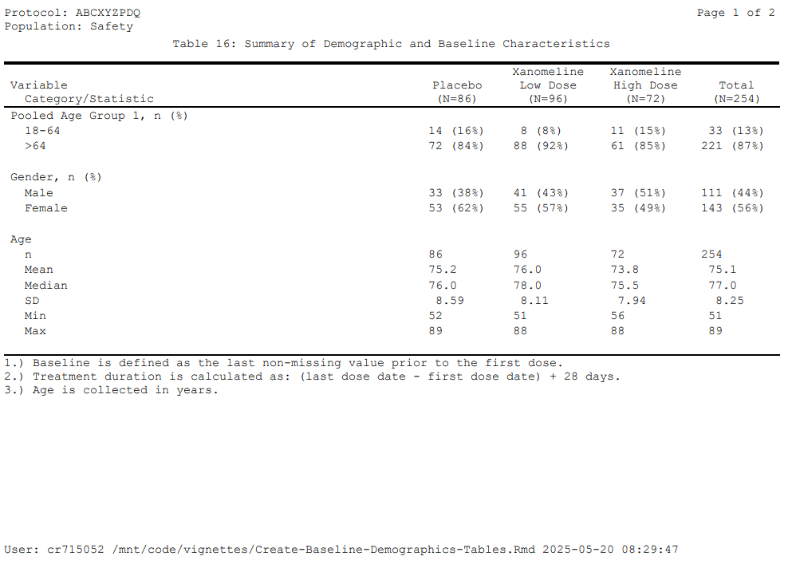
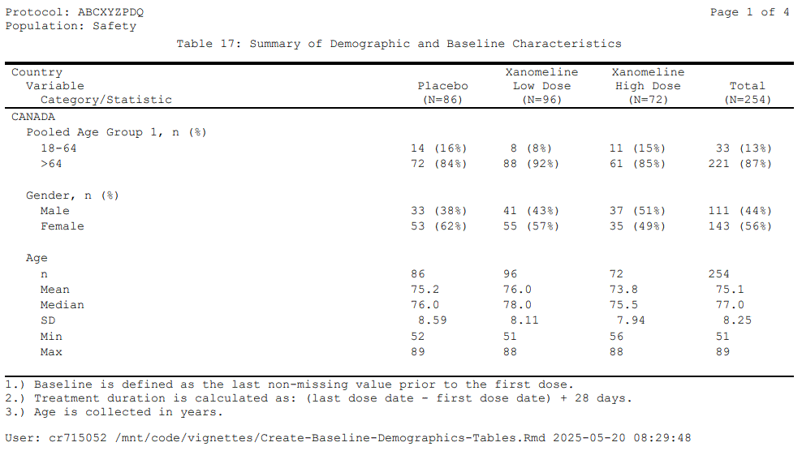
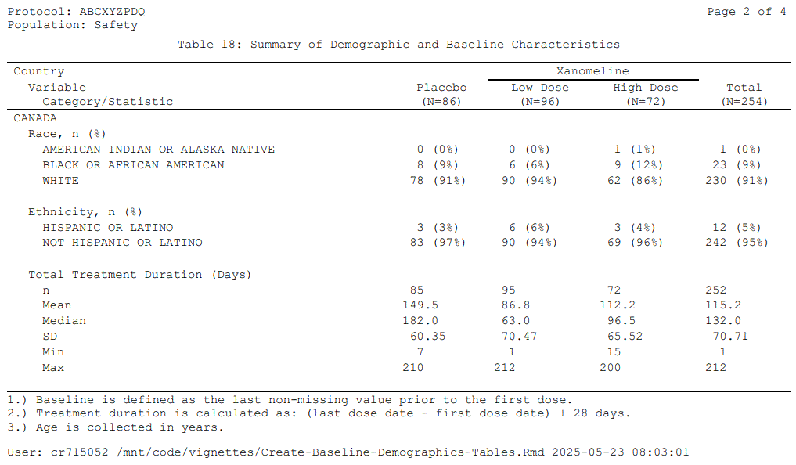
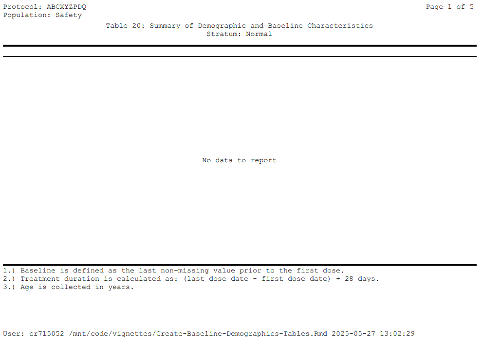
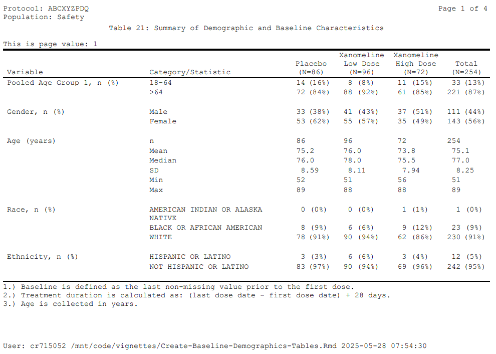

# Dem-Tbls

## Vignette Build Datetime

``` r
message(paste0('Datetime: ',Sys.Date(),':',Sys.time()))
#> Datetime: 2025-12-02:2025-12-02 21:10:33.577375
```

## Load Libraries

``` r
library(repfun)
library(dplyr)
library(DT)
library(kableExtra)
```

## Set Up the Reporting Environment

``` r
#====================================
# Set up the reporting environment.
#====================================
tmpdr <- tempdir()
setup <- function(tlfid){
  repfun::rs_setup(
    D_DATADATE=Sys.Date(),
    D_DSPLYNUM=tlfid,
    D_FOOT1='1.) Baseline is defined as the last non-missing value prior to the first dose.',
    D_FOOT2='2.) Treatment duration is calculated as: (last dose date - first dose date) + 28 days.',
    D_FOOT3='3.) Age is collected in years.',
    D_KEEPPOPVARS=c('STUDYID','USUBJID','SAFFL'),
    D_OUTFILE=paste0(tmpdr,"/t_ru_list_",tlfid,".rtf"),
    D_PGMPTH="~/vignettes/Dem-Tbls.Rmd",
    D_STUDYID='ABCXYZPDQ',
    D_POP="SAFFL",
    D_POPDATA=repfun::adsl %>% dplyr::filter(SAFFL =='Y') %>%
      dplyr::mutate(TRT01AN=ifelse(TRT01A=='Placebo',1,ifelse(TRT01A=='Xanomeline Low Dose',2,3))) %>%
      repfun::ru_labels(varlabels=list('TRT01AN'='Actual Treatment for Period 01 (n)')),
    D_POPLBL="Safety",
    D_SUBJID=c("STUDYID","USUBJID"),
    D_TITLE1=paste0('Table ',tlfid,': Summary of Demographic and Baseline Characteristics'),
    R_DDDATA=paste0(tmpdr,'/t_ru_list_',tlfid,'.rds'),
    R_ADAMDATA="../data")
}
setup(15)
tbl15dd <- paste0(tmpdr,"/t_ru_list_15.rds")
```

## Make Lists for Coding and Decoding ADSL Variables

## (Codes for Ordering Categories, Decodes for Category Labels)

``` r
fmtlist <- list('SEXS'=list('START'=list('M','F'),
                            'LABEL'=c('Male','Female')),
                'SEX1'=list('START'=list('Male','Female','Unknown'),
                            'LABEL'=c(1,2,3)),
                'AGE1'=list('START'=list('18-64','>64'),
                            'LABEL'=c(1,2)),
                'RAC1'=list('START'=list('AMERICAN INDIAN OR ALASKA NATIVE','BLACK OR AFRICAN AMERICAN','WHITE'),
                            'LABEL'=c(1,2,3)),
                'ETH1'=list('START'=list('HISPANIC OR LATINO','NOT HISPANIC OR LATINO'),
                            'LABEL'=c(1,2)))
```

## Perform the Coding and Decoding

``` r
G_POPDATA2 <- repfun::ru_fillcodedcode(
              repfun:::rfenv$G_POPDATA,
              codedecodevarpairs=c("SEX", "SEXC", "AGEGR1", "AGEGR1N", "RACE", "RACEN", "ETHNIC", "ETHNICN"),
              varcodelistpairs=c("SEX", "SEXS", "AGEGR1", "AGE1", "RACE", "RAC1", "ETHNIC", "ETH1"),
              codelistnames=fmtlist,
              completetypes=FALSE) %>% 
  repfun::ru_labels(varlabels=list('SEXC'='Gender','AGE'='Age (years)'))

G_POPDATA <- repfun::ru_fillcodedcode(
             G_POPDATA2,
             codedecodevarpairs=c("SEXC", "SEXCN"),
             varcodelistpairs=c("SEXC", "SEX1"),
             codelistnames=fmtlist,
             completetypes=FALSE) 
```

## Iterate over ADSL and Process a List of Categorical (Counts/Percents) and Numeric (Summary Statistics) Variables

``` r
dflst <- list()
df <- data.frame()

i <- 1
for(v in c('AGEGR1','SEXC','AGE','RACE','ETHNIC','TRTDURD')){
  lbl <- attr(G_POPDATA[[v]],'label')
  if (paste0(v,'N') %in% names(G_POPDATA)){
    #==========================================#
    # Generate counts/percents for categories. #
    #==========================================#
    dflst[[v]] <- repfun::ru_freq(
        G_POPDATA, dsetindenom=G_POPDATA, countdistinctvars=c("STUDYID", "USUBJID"),
        groupbyvarsnumer=c("STUDYID", "TRT01AN", paste0(v,'N')),
        anyeventvars = NULL, anyeventvalues = NULL, groupminmaxvar=NULL,
        totalforvar=c("TRT01AN"), totalid = 99, totaldecode = 'Total',
        groupbyvarsdenom=c("STUDYID", "TRT01AN"), resultstyle="NUMERPCT",
        codedecodevarpairs=c("TRT01AN", "TRT01A", paste0(v,'N'), v),
        resultpctdps=0) %>%
      dplyr::mutate(tt_avid=i, tt_avnm=lbl) %>%
      dplyr::rename(tt_svid=as.name(paste0(v,'N')), tt_svnm=as.name(v)) %>%
      dplyr::arrange(tt_avid,tt_svid) %>%
      dplyr::select(tt_avid,tt_avnm,tt_svid,tt_svnm,TRT01AN,TRT01A,tt_result,DENOMCNT) %>%
      dplyr::mutate(tt_avnm=paste0(tt_avnm,', n (%)'))
    df <- repfun::ru_setdata(df,dflst[[v]]) %>% dplyr::select(-DENOMCNT) %>% dplyr::select(-Row.names)
  } else {
    lbl <- attr(G_POPDATA[[v]],'label')
    #============================================#
    # Generate summary stats for non-categories. #
    #============================================#
    dflst[[v]] <- repfun::ru_sumstats(
        G_POPDATA, v, groupbyvars=c("STUDYID", "TRT01AN"),
        codedecodevarpairs=c("TRT01AN", "TRT01A"),
        totalforvar="TRT01AN", totalid=99, totaldecode="Total",
        statsinrowsyn = "Y",
        statslist=c("n", "mean", "median", "sd", "min", "max")) %>%
      dplyr::mutate(tt_avid=tt_avid + i - 1, tt_avnm=lbl) %>%
      dplyr::arrange(tt_avid,tt_svid) %>%
      dplyr::select(tt_avid,tt_avnm,tt_svid,tt_svnm,TRT01AN,TRT01A,tt_result)
    df <- repfun::ru_setdata(df,dflst[[v]]) %>% dplyr::select(-Row.names)
  }

  #===================================================#
  # Make alignment consistent across all data frames. #
  #===================================================#
  df <- df %>%
    dplyr::mutate(tt_result=paste0(strrep(' ',
                                   3-nchar(gsub(' ','',sub('(\\(|\\.).*$','',tt_result)))),
                                   trimws(tt_result)))
  i <- i+1
}
```

## Add Big N Value for Column Headers

``` r
rptdf <- repfun::ru_addbignvar(df,
                       G_POPDATA,
                       groupbyvars=c("TRT01AN", "TRT01A"),
                       totalforvar=c("TRT01AN"),
                       totalid = 99,
                       varcodelistpairs=c(""),
                       codedecodevarpairs=c("TRT01AN", "TRT01A"),
                       splitchar='\\line') %>% dplyr::select(-tt_bnnm) %>%
         dplyr::arrange(tt_avid,tt_svid)
```

------------------------------------------------------------------------

## Generate Table 15: Summary of Demographic and Baseline Characteristics \[Keywords: NoWidows, SkipVars, CentreVars, OrderVars, Denorm\]

------------------------------------------------------------------------

``` r
repfun::ru_list(dsetin=rptdf,
        columns=c('tt_avnm','tt_svnm','tt_01','tt_02','tt_03','tt_99'),
        nowidowvar='tt_avnm',
        widths=c(5,5.1,1.65,1.9,1.9,1.65),
        skipvars=c('tt_avnm'),
        centrevars=c('tt_01','tt_02','tt_03','tt_99'),
        ordervars=c('tt_avid','tt_svid'),
        noprintvars=c('tt_avid','tt_svid'),
        denormyn='Y',
        varsToDenorm=c('tt_result'),
        groupByVars=c('tt_avid','tt_avnm','tt_svid','tt_svnm'),
        acrossVar="TRT01AN",
        acrossVarLabel="TRT01A",
        acrossColVarPrefix='tt_',
        dddatasetlabel=paste0('DD Dataframe for DEMO Table ',repfun:::rfenv$G_DSPLYNUM),
        labels=list('tt_avnm'='Variable','tt_svnm'='Category/Statistic'))
```

### Select Page(s) of Table 15 (1)


Table 15 (pg 1) Image

### DDDATA for Table 15 (First few obs)

``` r
t15 <- readRDS(repfun:::rfenv$G_DDDATA) %>% dplyr::filter(tt_svnm != '') %>% dplyr::filter(row_number()<=20)
lbls <- sapply(t15,function(x){attr(x,"label")})
names(t15) <- paste(names(lbls),lbls,sep=": ")
datatable(
  t15, extensions = 'FixedColumns',
  options = list(
  dom = 't',
  pageLength=1000,
  scrollY = 300,
  scrollX = TRUE,
  scrollCollapse = TRUE
))
```

### Table 15 RTF

[Download](https://github.com/GSK-Biostatistics/repfun/blob/misc/outputs/t_ru_list_15.rtf)

### Table 15 PDF

[View](https://github.com/GSK-Biostatistics/repfun/blob/misc/outputs/t_ru_list_15.pdf)

------------------------------------------------------------------------

## Generate Table 16: Summary of Demographic and Baseline Characteristics \[Keywords: NoWidows, SkipVars, CentreVars, OrderVars, Denorm, ShareColVars\]

------------------------------------------------------------------------

``` r
setup(16)
repfun::ru_list(dsetin=rptdf,
        columns=c('tt_avnm','tt_svnm','tt_01','tt_02','tt_03','tt_99'),
        nowidowvar='tt_avnm',
        widths=c(8,1.65,1.9,1.9,1.65),
        skipvars=c('tt_avnm'),
        centrevars=c('tt_01','tt_02','tt_03','tt_99'),
        ordervars=c('tt_avid','tt_svid'),
        sharecolvars=c('tt_avnm','tt_svnm'),
        noprintvars=c('tt_avid','tt_svid'),
        denormyn='Y',
        varsToDenorm=c('tt_result'),
        groupByVars=c('tt_avid','tt_avnm','tt_svid','tt_svnm'),
        acrossVar="TRT01AN",
        acrossVarLabel="TRT01A",
        acrossColVarPrefix='tt_',
        dddatasetlabel=paste0('DD Dataframe for DEMO Table ',repfun:::rfenv$G_DSPLYNUM),
        labels=list('tt_avnm'='Variable','tt_svnm'='Category/Statistic'))
```

### Select Page(s) of Table 16 (1)



Table 16 (pg 1) Image

### DDDATA for Table 16 (First few obs)

``` r
t16 <- readRDS(repfun:::rfenv$G_DDDATA) %>% dplyr::filter(gsub("\\s+", "", STACKVAR) != '') %>% dplyr::filter(row_number()<=20)
lbls <- sapply(t16,function(x){attr(x,"label")})
names(t16) <- paste(names(lbls),lbls,sep=": ")
datatable(
  t16, extensions = 'FixedColumns',
  options = list(
  dom = 't',
  pageLength=1000,
  scrollY = 300,
  scrollX = TRUE,
  scrollCollapse = TRUE
))
```

### Table 16 RTF

[Download](https://github.com/GSK-Biostatistics/repfun/blob/misc/outputs/t_ru_list_16.rtf)

### Table 16 PDF

[View](https://github.com/GSK-Biostatistics/repfun/blob/misc/outputs/t_ru_list_16.pdf)

------------------------------------------------------------------------

## Generate Table 17: Summary of Demographic and Baseline Characteristics \[Keywords: NoWidows, ShareColVars, NoPrintVars, OrderVars, SkipVars\]

------------------------------------------------------------------------

``` r
setup(17)

df <- readRDS(file=tbl15dd) %>% dplyr::select(-PAGEVAR) %>% dplyr::filter(!(tt_svnm == ''))
dfpg <- rbind(df %>% dplyr::mutate(COUNTRY='CANADA'),df %>% dplyr::mutate(COUNTRY='USA')) %>% dplyr::select(COUNTRY, everything())

dfpg %>% dplyr::mutate(rnum=row_number()) %>% dplyr::group_by(COUNTRY,tt_avnm) %>% dplyr::filter (row_number()==1) %>% dplyr::ungroup() %>%
  dplyr::distinct(COUNTRY,tt_avnm,rnum) -> dford

dfpg %>% left_join(dford,by=c('COUNTRY','tt_avnm')) %>% repfun::ru_labels(varlabels=list('COUNTRY'='Country')) -> dfpg

repfun::ru_list(dsetin=dfpg,
        columns=c('COUNTRY','tt_avnm','tt_svnm','tt_01','tt_02','tt_03','tt_99'),
        nowidowvar='tt_avnm',
        sharecolvars=c('COUNTRY','tt_avnm','tt_svnm'),
        ordervars=c('rnum'),
        noprintvars=c('rnum'),
        widths=c(7,1.65,1.9,1.9,1.65),
        skipvars=c('COUNTRY','tt_avnm'),
        centrevars=c('tt_01','tt_02','tt_03','tt_99'),
        lpp=27,
        dddatasetlabel=paste0('DD Dataframe for DEMO Table ',repfun:::rfenv$G_DSPLYNUM))
```

### Select Page(s) of Table 17 (1)



Table 17 (pg 1) Image

### DDDATA for Table 17 (First few obs)

``` r
t17 <- readRDS(repfun:::rfenv$G_DDDATA) %>% dplyr::filter(gsub("\\s+", "", STACKVAR) != '') %>% dplyr::filter(row_number()<=20)
lbls <- sapply(t17,function(x){attr(x,"label")})
names(t17) <- paste(names(lbls),lbls,sep=": ")
datatable(
  t17, extensions = 'FixedColumns',
  options = list(
  dom = 't',
  pageLength=1000,
  scrollY = 300,
  scrollX = TRUE,
  scrollCollapse = TRUE
))
```

### Table 17 RTF

[Download](https://github.com/GSK-Biostatistics/repfun/blob/misc/outputs/t_ru_list_17.rtf)

### Table 17 PDF

[View](https://github.com/GSK-Biostatistics/repfun/blob/misc/outputs/t_ru_list_17.pdf)

------------------------------------------------------------------------

## Generate Table 18: Summary of Demographic and Baseline Characteristics \[Keywords: Spanning Columns, NoWidows, ShareColVars, NoPrintVars, OrderVars, SkipVars\]

------------------------------------------------------------------------

``` r
setup(18)

dfpg %>% repfun::ru_labels(list('COUNTRY'='',
                        'tt_avnm'=paste0("\\u160* ",attr(dfpg$tt_avnm,'label')),
                        'tt_02'=gsub('Xanomeline ','',attr(dfpg$tt_02,'label')),
                        'tt_03'=gsub('Xanomeline ','',attr(dfpg$tt_03,'label'))))-> dfpg

repfun::ru_list(dsetin=dfpg,
        columns=c('COUNTRY','tt_avnm','tt_svnm','tt_01','tt_02','tt_03','tt_99'),
        nowidowvar='tt_avnm',
        sharecolvars=c('COUNTRY','tt_avnm','tt_svnm'),
        ordervars=c('rnum'),
        noprintvars=c('rnum'),
        widths=c(7,1.65,1.9,1.9,1.65),
        skipvars=c('COUNTRY','tt_avnm'),
        centrevars=c('tt_01','tt_02','tt_03','tt_99'),
        lpp=27,
        toprow='',
        spanlbls=paste0("Country|Xanomeline| "),
        spanwidths=c(8.65,3.8,1.65),
        spanjust=c('l','c','c'),
        spanbbord=c('','single',''),
        spantbord=c('single','single','single'),
        dddatasetlabel=paste0('DD Dataframe for DEMO Table ',repfun:::rfenv$G_DSPLYNUM))
```

### Select Page(s) of Table 18 (2)



Table 18 (pg 2) Image

### DDDATA for Table 18 (First few obs)

``` r
t18 <- readRDS(repfun:::rfenv$G_DDDATA) %>% dplyr::filter(gsub("\\s+", "", STACKVAR) != '') %>% dplyr::filter(row_number()<=20)
lbls <- sapply(t18,function(x){attr(x,"label")})
names(t18) <- paste(names(lbls),lbls,sep=": ")
datatable(
  t18, extensions = 'FixedColumns',
  options = list(
  dom = 't',
  pageLength=1000,
  scrollY = 300,
  scrollX = TRUE,
  scrollCollapse = TRUE
))
```

### Table 18 RTF

[Download](https://github.com/GSK-Biostatistics/repfun/blob/misc/outputs/t_ru_list_18.rtf)

### Table 18 PDF

[View](https://github.com/GSK-Biostatistics/repfun/blob/misc/outputs/t_ru_list_18.pdf)

------------------------------------------------------------------------

## Generate Table 19: Summary of Demographic and Baseline Characteristics \[Keywords: Double Spanning Columns, NoWidows, ShareColVars, NoPrintVars, OrderVars, SkipVars\]

------------------------------------------------------------------------

``` r
setup(19)

repfun::ru_list(dsetin=dfpg,
        columns=c('COUNTRY','tt_avnm','tt_svnm','tt_01','tt_02','tt_03','tt_99'),
        nowidowvar='tt_avnm',
        sharecolvars=c('COUNTRY','tt_avnm','tt_svnm'),
        ordervars=c('rnum'),
        noprintvars=c('rnum'),
        widths=c(7,1.65,1.9,1.9,1.65),
        skipvars=c('COUNTRY','tt_avnm'),
        centrevars=c('tt_01','tt_02','tt_03','tt_99'),
        lpp=27,
        spanlbls=paste0("Country| |Xanomeline| "),
        toprow='',
        spanwidths=c(7,1.65,3.8,1.65),
        spanjust=c('l','c','c','c'),
        spanbbord=c('','','single',''),
        spantbord=c('','','',''),
        span2lbls=paste0(" |All Active Treatments"),
        span2widths=c(7,7.1),
        span2just=c('c','c'),
        span2bbord=c('','single'),
        dddatasetlabel=paste0('DD Dataframe for DEMO Table ',repfun:::rfenv$G_DSPLYNUM))
```

### Select Page(s) of Table 19 (1)


Table 19 (pg 1) Image

### DDDATA for Table 19 (First few obs)

``` r
t19 <- readRDS(repfun:::rfenv$G_DDDATA) %>% dplyr::filter(gsub("\\s+", "", STACKVAR) != '') %>% dplyr::filter(row_number()<=20)
lbls <- sapply(t19,function(x){attr(x,"label")})
names(t19) <- paste(names(lbls),lbls,sep=": ")
datatable(
  t19, extensions = 'FixedColumns',
  options = list(
  dom = 't',
  pageLength=1000,
  scrollY = 300,
  scrollX = TRUE,
  scrollCollapse = TRUE
))
```

### Table 19 RTF

[Download](https://github.com/GSK-Biostatistics/repfun/blob/misc/outputs/t_ru_list_19.rtf)

### Table 19 PDF

[View](https://github.com/GSK-Biostatistics/repfun/blob/misc/outputs/t_ru_list_19.pdf)

------------------------------------------------------------------------

## Generate Table 20: Summary of Demographic and Baseline Characteristics \[Keywords: ByPageVariable, NoWidows, SharColVars OrderVars, SkipVars, NoData\]

------------------------------------------------------------------------

``` r
setup(20)

df <- readRDS(file=tbl15dd) %>% dplyr::select(-PAGEVAR) %>% dplyr::filter(!(tt_svnm == ''))
dfpg <- rbind(df %>% dplyr::mutate(COUNTRY='CANADA'),df %>% dplyr::mutate(COUNTRY='USA')) %>% dplyr::select(COUNTRY, everything())

dfpg %>% dplyr::mutate(rnum=row_number()) %>% dplyr::group_by(COUNTRY,tt_avnm) %>% dplyr::filter (row_number()==1) %>% dplyr::ungroup() %>%
  dplyr::distinct(COUNTRY,tt_avnm,rnum) -> dford

dfpg <- dfpg %>% left_join(dford,by=c('COUNTRY','tt_avnm')) %>% repfun::ru_labels(varlabels=list('COUNTRY'='Country')) %>%
  repfun::ru_labels(list('COUNTRY'='Country'))

mytbls <- list('Stratum: Normal'=dfpg[0,], 'Stratum: Abnormal'=dfpg)
repfun::ru_list(dsetin=mytbls,
        columns=c('COUNTRY','tt_avnm','tt_svnm','tt_01','tt_02','tt_03','tt_99'),
        nowidowvar='tt_avnm',
        sharecolvars=c('COUNTRY','tt_avnm','tt_svnm'),
        ordervars=c('rnum'),
        noprintvars=c('rnum'),
        widths=c(7,1.65,1.9,1.9,1.65),
        skipvars=c('COUNTRY','tt_avnm'),
        centrevars=c('tt_01','tt_02','tt_03','tt_99'),
        lpp = 28,
        dddatasetlabel=paste0('DD Dataframe for DEMO Table ',repfun:::rfenv$G_DSPLYNUM))
```

### Select Page(s) of Table 20 (1)



Table 20 (pg 1) Image

### DDDATA for Table 20 (First few obs)

``` r
t20 <- readRDS(repfun:::rfenv$G_DDDATA) %>% dplyr::filter(gsub("\\s+", "", STACKVAR) != '') %>% dplyr::filter(row_number()<=20)
lbls <- sapply(t20,function(x){attr(x,"label")})
names(t20) <- paste(names(lbls),lbls,sep=": ")
datatable(
  t20, extensions = 'FixedColumns',
  options = list(
  dom = 't',
  pageLength=1000,
  scrollY = 300,
  scrollX = TRUE,
  scrollCollapse = TRUE
))
```

### Table 20 RTF

[Download](https://github.com/GSK-Biostatistics/repfun/blob/misc/outputs/t_ru_list_20.rtf)

### Table 20 PDF

[View](https://github.com/GSK-Biostatistics/repfun/blob/misc/outputs/t_ru_list_20.pdf)

------------------------------------------------------------------------

## Generate Table 21: Summary of Demographic and Baseline Characteristics \[Keywords: ByPageVariable, NoWidows, OrderVars, SkipVars\]

------------------------------------------------------------------------

``` r
setup(21)

df <- readRDS(file=tbl15dd) %>% dplyr::select(-PAGEVAR) %>% dplyr::filter(!(tt_svnm == ''))
dfpg <- rbind(df %>% dplyr::mutate(MYPAGEVAR=1),df %>% dplyr::mutate(MYPAGEVAR=2))
dfpg %>% dplyr::mutate(rnum=row_number()) %>% dplyr::group_by(tt_avnm) %>% dplyr::filter (row_number()==1) %>% dplyr::ungroup() %>% dplyr::distinct(tt_avnm,rnum) -> dford
dfpg <- dfpg %>% left_join(dford,by='tt_avnm') %>% repfun::ru_labels(varlabels=list('MYPAGEVAR'='My Page Variable'))

repfun::ru_list(dsetin=dfpg,
        columns=c('tt_avnm','tt_svnm','tt_01','tt_02','tt_03','tt_99'),
        widths=c(5,5,1.65,1.9,1.9,1.65),
        nowidowvar='tt_avnm',
        skipvars=c('tt_avnm'),
        ordervars=c('rnum'),
        noprintvars=c('rnum'),
        centrevars=c('tt_01','tt_02','tt_03','tt_99'),
        pagevars=c('MYPAGEVAR'),
        computebeforepagelines="paste0('This is page value: ',MYPAGEVAR)",
        lpp=28,
        dddatasetlabel=paste0('DD Dataframe for DEMO Table ',repfun:::rfenv$G_DSPLYNUM))
```

### Select Page(s) of Table 21 (1)



Table 21 (pg 1) Image

### DDDATA for Table 21 (First few obs)

``` r
t21 <- readRDS(repfun:::rfenv$G_DDDATA) %>% dplyr::filter(gsub("\\s+", "", tt_svnm) != '') %>% dplyr::filter(row_number()<=20)
lbls <- sapply(t21,function(x){attr(x,"label")})
names(t21) <- paste(names(lbls),lbls,sep=": ")
datatable(
  t21, extensions = 'FixedColumns',
  options = list(
  dom = 't',
  pageLength=1000,
  scrollY = 300,
  scrollX = TRUE,
  scrollCollapse = TRUE
))
```

### Table 21 RTF

[Download](https://github.com/GSK-Biostatistics/repfun/blob/misc/outputs/t_ru_list_21.rtf)

### Table 21 PDF

[View](https://github.com/GSK-Biostatistics/repfun/blob/misc/outputs/t_ru_list_21.pdf)

------------------------------------------------------------------------

## Generate Table 22: Summary of Demographic and Baseline Characteristics \[Keywords: ByPageVariable, NoWidows, SharColVars OrderVars, SkipVars\]

------------------------------------------------------------------------

``` r
setup(22)

repfun::ru_list(dsetin=dfpg,
        columns=c('tt_avnm','tt_svnm','tt_01','tt_02','tt_03','tt_99'),
        widths=c(8,1.65,1.9,1.9,1.65),
        nowidowvar='tt_avnm',
        skipvars=c('tt_avnm'),
        sharecolvars=c('tt_avnm','tt_svnm'),
        ordervars=c('rnum'),
        noprintvars=c('rnum'),
        centrevars=c('tt_01','tt_02','tt_03','tt_99'),
        pagevars=c('MYPAGEVAR'),
        computebeforepagelines="paste0('This is page value: ',MYPAGEVAR)",
        lpp=26,
        dddatasetlabel=paste0('DD Dataframe for DEMO Table ',repfun:::rfenv$G_DSPLYNUM))
```

### Select Page(s) of Table 22 (1)


Table 22 (pg 1) Image

### DDDATA for Table 22 (First few obs)

``` r
t22 <- readRDS(repfun:::rfenv$G_DDDATA) %>% dplyr::filter(gsub("\\s+", "", STACKVAR) != '') %>% dplyr::filter(row_number()<=20)
lbls <- sapply(t22,function(x){attr(x,"label")})
names(t22) <- paste(names(lbls),lbls,sep=": ")
datatable(
  t22, extensions = 'FixedColumns',
  options = list(
  dom = 't',
  pageLength=1000,
  scrollY = 300,
  scrollX = TRUE,
  scrollCollapse = TRUE
))
```

### Table 22 RTF

[Download](https://github.com/GSK-Biostatistics/repfun/blob/misc/outputs/t_ru_list_22.rtf)

### Table 22 PDF

[View](https://github.com/GSK-Biostatistics/repfun/blob/misc/outputs/t_ru_list_22.pdf)

------------------------------------------------------------------------

## Generate Table 23: Summary of Demographic and Baseline Characteristics \[Keywords: ByPageVariable, NoWidows, SharColVars OrderVars, SkipVars\]

------------------------------------------------------------------------

``` r
setup(23)

df <- readRDS(file=tbl15dd) %>% 
  dplyr::select(-PAGEVAR) %>% dplyr::filter(!(tt_svnm == ''))
dfpg <- rbind(df %>% dplyr::mutate(MYPAGEVAR1=1,MYPAGEVAR2=1),
              df %>% dplyr::mutate(MYPAGEVAR1=1,MYPAGEVAR2=2),
              df %>% dplyr::mutate(MYPAGEVAR1=2,MYPAGEVAR2=3),
              df %>% dplyr::mutate(MYPAGEVAR1=2,MYPAGEVAR2=4))
dford <- dfpg %>% dplyr::mutate(rnum=row_number()) %>% 
  dplyr::group_by(MYPAGEVAR1,MYPAGEVAR2,tt_avnm) %>% 
  dplyr::filter (row_number()==1) %>% dplyr::ungroup() %>% 
  dplyr::distinct(MYPAGEVAR1,MYPAGEVAR2,tt_avnm,rnum)
dfpg <- dfpg %>% left_join(dford,by=c('tt_avnm', 'MYPAGEVAR1', 'MYPAGEVAR2')) 

lblist <- list('tt_avnm'='New Variable Label', 'tt_svnm'='New Category Label')
repfun::ru_list(dsetin=dfpg,
        columns=c('tt_avnm','tt_svnm','tt_01','tt_02','tt_03','tt_99'),
        nowidowvar='tt_avnm',
        widths=c(6,4,2,2,2,2),
        skipvars=c('tt_avnm'),
        centrevars=c('tt_01','tt_02','tt_03','tt_99'),
        ordervars=c('rnum'),
        noprintvars=c('rnum'),
        byvars=c('MYPAGEVAR2'),
        pagevars=c('MYPAGEVAR1'),
        computebeforepagelines="paste0('This is page value 1: ',MYPAGEVAR1,' and this is page value 2: ',MYPAGEVAR2)",
        lpp=28,
        labels=lblist,
        dddatasetlabel=paste0('DD Dataframe for DEMO Table ',repfun:::rfenv$G_DSPLYNUM))
```

### Select Page(s) of Table 23 (1)


Table 23 (pg 1) Image

### DDDATA for Table 23 (First few obs)

``` r
t23 <- readRDS(repfun:::rfenv$G_DDDATA) %>% dplyr::filter(gsub("\\s+", "", tt_svnm) != '') %>% dplyr::filter(row_number()<=20)
lbls <- sapply(t23,function(x){attr(x,"label")})
names(t23) <- paste(names(lbls),lbls,sep=": ")
datatable(
  t23, extensions = 'FixedColumns',
  options = list(
  dom = 't',
  pageLength=1000,
  scrollY = 300,
  scrollX = TRUE,
  scrollCollapse = TRUE
))
```

### Table 23 RTF

[Download](https://github.com/GSK-Biostatistics/repfun/blob/misc/outputs/t_ru_list_23.rtf)

### Table 23 PDF

[View](https://github.com/GSK-Biostatistics/repfun/blob/misc/outputs/t_ru_list_23.pdf)

## Clean up Temporary Files

``` r
unlink(tmpdr, recursive = TRUE)
```
