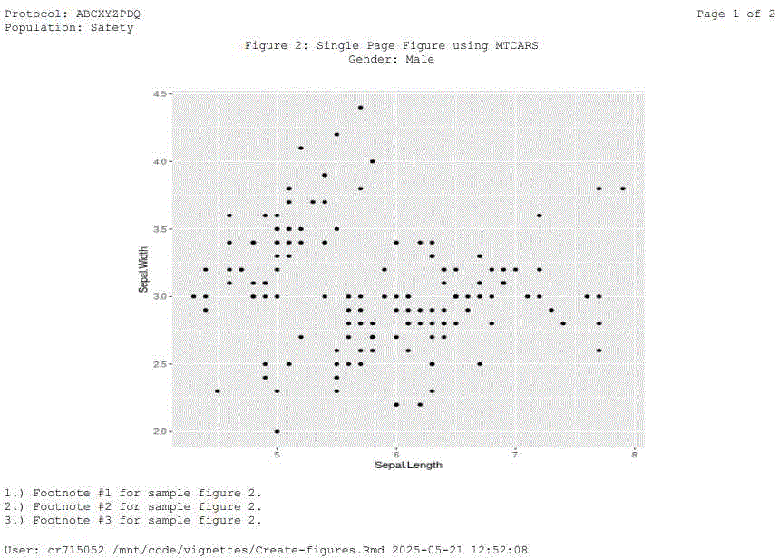

# Figures

## Vignette Build Datetime

``` r
message(paste0('Datetime: ',Sys.Date(),':',Sys.time()))
#> Datetime: 2026-01-02:2026-01-02 10:24:19.807769
```

## Load Libraries

``` r
library(repfun)
library(dplyr)
library(DT)
library(kableExtra)
library(ggplot2)
```

## Set Up the Reporting Environment

``` r
#====================================
# Set up the reporting environment.
#====================================
tmpdr <- tempdir()
setup <- function(tlfid){
  repfun::rs_setup(
    D_DATADATE=Sys.Date(),
    D_DSPLYNUM=tlfid,
    D_DSPLYTYP=F,
    D_FOOT1=paste0('1.) Footnote #1 for sample figure ',tlfid,'.'),
    D_FOOT2=paste0('2.) Footnote #2 for sample figure ',tlfid,'.'),
    D_FOOT3=paste0('3.) Footnote #3 for sample figure ',tlfid,'.'),
    D_KEEPPOPVARS=c('STUDYID','USUBJID','SAFFL'),
    D_OUTFILE=paste0(tmpdr,"/t_ru_list_fig_",tlfid,".rtf"),
    D_PGMPTH="~/vignettes/Figures.Rmd",
    D_STUDYID='ABCXYZPDQ',
    D_POP="SAFFL",
    D_POPDATA=repfun::adae %>% dplyr::filter(SAFFL =='Y') %>%
      dplyr::mutate(TRT01AN=ifelse(TRT01A=='Placebo',1,ifelse(TRT01A=='Xanomeline Low Dose',2,3))) %>%
      repfun::ru_labels(varlabels=list('TRT01AN'='Actual Treatment for Period 01 (n)')),
    D_POPLBL="Safety",
    D_SUBJID=c("STUDYID","USUBJID"),
    D_TITLE1=paste0('Figure ',tlfid,': Figure using IRIS Data Set'),
    R_DDDATA=paste0(tmpdr,'/t_ru_list_fig_',tlfid,'.rds'),
    R_ADAMDATA="../data")
}
```

------------------------------------------------------------------------

## Generate Figure 1: Sepal Length by Sepal Width from IRIS Data Set \[Keywords: Single Page Figure\]

------------------------------------------------------------------------

``` r
setup(1)
myplot <- ggplot(iris, aes(Sepal.Length, Sepal.Width)) + geom_point()
repfun::ru_list(dsetin=myplot,
        dddatasetlabel='DD Dataframe for Figure 1')
```

### Select Page(s) of Figure 1 (1)


Figure 1 (pg 1) Image

------------------------------------------------------------------------

### DDDATA for Figure 1

``` r
f1 <- readRDS(repfun:::rfenv$G_DDDATA) %>% dplyr::filter(row_number()<=10)
lbls <- sapply(f1,function(x){attr(x,"label")})
datatable(
  f1, extensions = 'FixedColumns',
  options = list(
  pageLength=1000,
  scrollY = 300,
  dom = 't',
  scrollX = TRUE,
  scrollCollapse = TRUE
))
```

### Figure 1 RTF

[Download](https://github.com/GSK-Biostatistics/repfun/blob/misc/outputs/t_ru_list_fig_1.rtf)

### Figure 1 PDF

[View](https://github.com/GSK-Biostatistics/repfun/blob/misc/outputs/t_ru_list_fig_1.pdf)

------------------------------------------------------------------------

## Generate Figure 2: Two Page Plot with Different Structures using IRIS Data Set \[Keywords: Multi-Page Figure\]

------------------------------------------------------------------------

``` r
setup(2)
assign("G_HEIGHT", repfun:::rfenv$G_HEIGHT-.15 ,envir=repfun:::rfenv)
myplot1 <- ggplot(iris, aes(Sepal.Length, Sepal.Width)) + geom_point()
myplot2 <- ggplot(iris, aes(Species, Sepal.Length)) + geom_boxplot()
myplots <- list('Gender: Male'=myplot1, 'Gender: Female'=myplot2)
repfun::ru_list(dsetin=myplots,
        dddatasetlabel='DD Dataframe for Figure 2')
```

### Select Page(s) of Figure 2 (1)



Figure 2 (pg 1) Image

------------------------------------------------------------------------

### DDDATA for Figure 2

``` r
f2 <- readRDS(repfun:::rfenv$G_DDDATA) %>% dplyr::filter(row_number()<=10)
lbls <- sapply(f2,function(x){attr(x,"label")})
datatable(
  f2, extensions = 'FixedColumns',
  options = list(
  dom = 't',
  pageLength=1000,
  scrollY = 300,
  scrollX = TRUE,
  scrollCollapse = TRUE
))
```

### Figure 2 RTF

[Download](https://github.com/GSK-Biostatistics/repfun/blob/misc/outputs/t_ru_list_fig_2.rtf)

### Figure 2 PDF

[View](https://github.com/GSK-Biostatistics/repfun/blob/misc/outputs/t_ru_list_fig_2.pdf)

## Clean up Temporary Files

``` r
unlink(tmpdr, recursive = TRUE)
```
