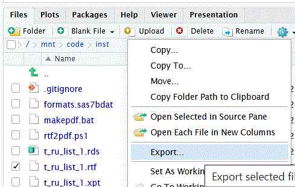
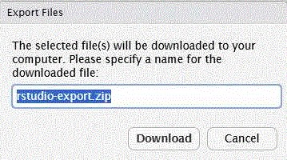
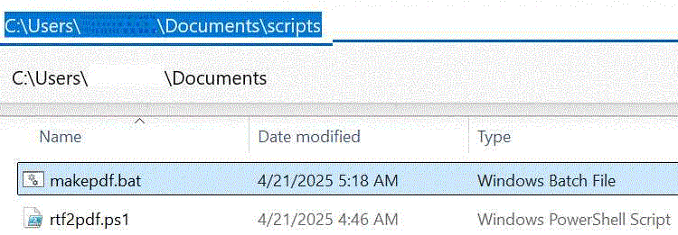
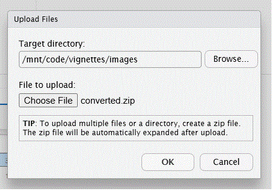

<style>
body {
    position: absolute;
    left: 50px;}
</style>

```{r, include =FALSE}
knitr::opts_chunk$set(
  collapse = TRUE,
  comment = "#>"
)
```

## Vignette Build Datetime

```{r built}
message(paste0('Datetime: ',Sys.Date(),':',Sys.time()))
```

<hr style="border: none; border-top: 6px solid #000;">
<div style="text-align: center;">
## Generate PDFs from RTFs for NON-PRODUCTION Work in 3 Clicks (Unlimited Number of Files)
### (Must use Pulsar for PRODUCTION Work)
</div>
<hr style="border: none; border-top: 6px solid #000;">

<br>

## Create Folder Structure on Windows

**Step 1.)  Create the following folder structure using your MUDID:**

C:/Users/USERNAME/Documents/

<br>

**Step 2.) Create the following 2 sub-folders under the Documents folder created in Step 1:**

C:/Users/USERNAME/Documents/rtf_files/ <br>
C:/Users/USERNAME/Documents/scripts/

<br>

**Step 3.) Copy the following 2 files into the scripts folder created in Step 2:**

https://github.com/GSK-Biostatistics/repfun/blob/misc/outputs/rtf2pdf.ps1 <br>
https://github.com/GSK-Biostatistics/repfun/blob/misc/outputs/makepdf.bat

<br>

**Step 4.) Create RTF outputs as needed, for example see Vignette 'Create-AE-Tables'**

<br>

**Step 5.) From within R Studio files pane, select and Export the RTF files produced in Step 4 (see below).**


<br>
<br>

**Step 6.) Click download (see below).**



<br>
<br>

**Step 7.) Run the batch file copied in Step 3 (see below).**



<br>
<br>

**The following file is produced from Step 7 (see below).**

<br>
<br>

**Step 8: Final step is to upload the converted.zip file from R Studio files pane (see below).**

<br>
<br>

**For future conversions repeat Steps 5 thru 8. (The most recent zip file in the downloads folder will be processed.)**

