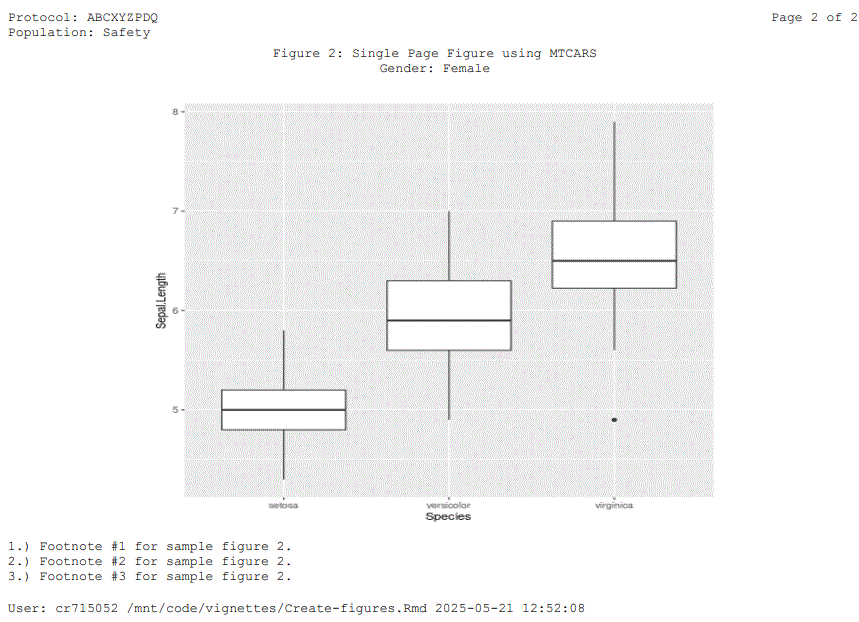

```{r, include = FALSE}
knitr::opts_chunk$set(
  collapse = TRUE,
  comment = "#>"
)
```

## Vignette Build Datetime

```{r built}
message(paste0('Datetime: ',Sys.Date(),':',Sys.time()))
```

## Load Libraries

```{r setup, message=FALSE}
library(repfun)
library(dplyr)
library(DT)
library(kableExtra)
library(ggplot2)
```

## Set Up the Reporting Environment

```{r envir}
#====================================
# Set up the reporting environment.
#====================================
tmpdr <- tempdir()
setup <- function(tlfid){
  repfun::rs_setup(
    D_DATADATE=Sys.Date(),
    D_DSPLYNUM=tlfid,
    D_DSPLYTYP=F,
    D_FOOT1=paste0('1.) Footnote #1 for sample figure ',tlfid,'.'),
    D_FOOT2=paste0('2.) Footnote #2 for sample figure ',tlfid,'.'),
    D_FOOT3=paste0('3.) Footnote #3 for sample figure ',tlfid,'.'),
    D_KEEPPOPVARS=c('STUDYID','USUBJID','SAFFL'),
    D_OUTFILE=paste0(tmpdr,"/t_ru_list_fig_",tlfid,".rtf"),
    D_PGMPTH="~/vignettes/Figures.Rmd",
    D_STUDYID='ABCXYZPDQ',
    D_POP="SAFFL",
    D_POPDATA=repfun::adae %>% dplyr::filter(SAFFL =='Y') %>%
      dplyr::mutate(TRT01AN=ifelse(TRT01A=='Placebo',1,ifelse(TRT01A=='Xanomeline Low Dose',2,3))) %>%
      repfun::ru_labels(varlabels=list('TRT01AN'='Actual Treatment for Period 01 (n)')),
    D_POPLBL="Safety",
    D_SUBJID=c("STUDYID","USUBJID"),
    D_TITLE1=paste0('Figure ',tlfid,': Figure using IRIS Data Set'),
    R_DDDATA=paste0(tmpdr,'/t_ru_list_fig_',tlfid,'.rds'),
    R_ADAMDATA="../data")
}
```

<!-- ************************************************************************************************************************************************** -->
<!-- ************************************************************************************************************************************************** -->

<hr style="border: none; border-top: 8px solid #000;">
<div style="text-align: center;">
## Generate Figure 1: Sepal Length by Sepal Width from IRIS Data Set [Keywords: Single Page Figure]
</div>
<hr style="border: none; border-top: 8px solid #000;">

<!-- ************************************************************************************************************************************************** -->
<!-- ************************************************************************************************************************************************** -->

```{r makef1}
setup(1)
myplot <- ggplot(iris, aes(Sepal.Length, Sepal.Width)) + geom_point()
repfun::ru_list(dsetin=myplot,
        dddatasetlabel='DD Dataframe for Figure 1')

```

### Select Page(s) of Figure 1 (1)


<hr style="border: none; width: 20%; border-top: 1px solid #000;">

### DDDATA for Figure 1

```{r dddataf1, results='asis'}
f1 <- readRDS(repfun:::rfenv$G_DDDATA) 
lbls <- sapply(f1,function(x){attr(x,"label")})
datatable(
  f1, extensions = 'FixedColumns',
  options = list(
  pageLength=1000,
  scrollY = 300,
  dom = 't',
  scrollX = TRUE,
  scrollCollapse = TRUE
))
```

### Figure 1 RTF 

<a href=https://github.com/GSK-Biostatistics/repfun/tree/misc/outputs/t_ru_list_fig_1.rtf target="_blank" download>Download</a>

### Figure 1 PDF

<a href=https://github.com/GSK-Biostatistics/repfun/tree/misc/outputs/t_ru_list_fig_1.pdf target="_blank" download>View</a>

<!-- ************************************************************************************************************************************************** -->
<!-- ************************************************************************************************************************************************** -->

<hr style="border: none; border-top: 8px solid #000;">
<div style="text-align: center;">
## Generate Figure 2: Two Page Plot with Different Structures using IRIS Data Set [Keywords: Multi-Page Figure]
</div>
<hr style="border: none; border-top: 8px solid #000;">

<!-- ************************************************************************************************************************************************** -->
<!-- ************************************************************************************************************************************************** -->

```{r makef2}
setup(2)
assign("G_HEIGHT", repfun:::rfenv$G_HEIGHT-.15 ,envir=repfun:::rfenv)
myplot1 <- ggplot(iris, aes(Sepal.Length, Sepal.Width)) + geom_point()
myplot2 <- ggplot(iris, aes(Species, Sepal.Length)) + geom_boxplot()
myplots <- list('Gender: Male'=myplot1, 'Gender: Female'=myplot2)
repfun::ru_list(dsetin=myplots,
        dddatasetlabel='DD Dataframe for Figure 2')
```

### Select Page(s) of Figure 2 (1,2)


<hr style="border: none; width: 20%; border-top: 1px solid #000;">

<hr style="border: none; width: 20%; border-top: 1px solid #000;">


### DDDATA for Figure 2

```{r dddataf2, results='asis'}
f2 <- readRDS(repfun:::rfenv$G_DDDATA) 
lbls <- sapply(f2,function(x){attr(x,"label")})
datatable(
  f2, extensions = 'FixedColumns',
  options = list(
  dom = 't',
  pageLength=1000,
  scrollY = 300,
  scrollX = TRUE,
  scrollCollapse = TRUE
))
```

### Figure 2 RTF 

<a href=https://github.com/GSK-Biostatistics/repfun/tree/misc/outputs/t_ru_list_fig_2.rtf target="_blank" download>Download</a>

### Figure 2 PDF

<a href=https://github.com/GSK-Biostatistics/repfun/tree/misc/outputs/t_ru_list_fig_2.pdf target="_blank" download>View</a>

## Clean up Temporary Files

```{r cleanup}
unlink(tmpdr, recursive = TRUE)
```
